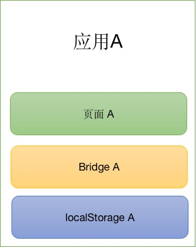
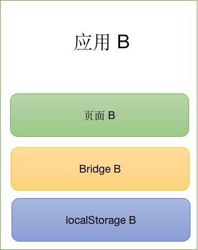
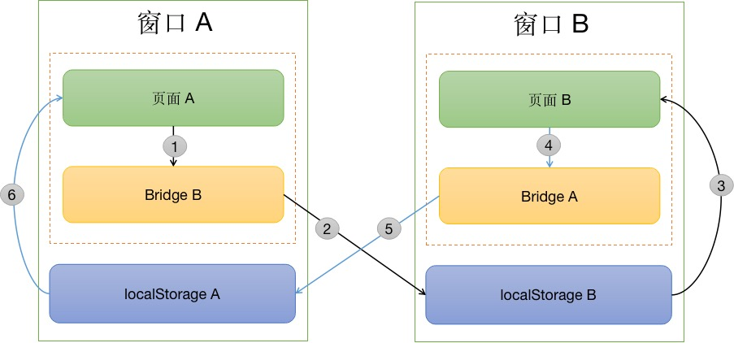

# 跨浏览器窗体消息通讯

## 需求

### 页面跨域消息传递

A页面中用`iframe`加载了B页面， 这两个页面不同源，需要双向通讯。


### 页面跨浏览器窗体消息传递

同一个浏览器同时打开A页面 和 B页面， 这两个页面不同源，也需要双向通讯。

## 原理

### postMessage

`postMessage` 可以实现不同源的页面在`iframe`中通讯， 但是不能跨浏览器窗体。

### localStorage
当 `localStorage` 存储的值发生变化时会在当前窗体window触发 storage 事件。
多个同源的页面是共享localStorage，因此浏览器同时打开多个同源页面，只要localStorage改变了，都会收到 storage 事件。

## Bridge 桥

`postMessage` 可不同源通讯，但是不能跨窗体，`localStorage`可以跨窗体，但是只限同源页面。 不能满足跨窗体不同源的通讯需求。

为了满足需求，整合`postMessage`和`localStorage`的特性，实现既能跨窗体也可以不同源的消息通讯方案，我们称这个方案叫 `桥`

就是为两个窗体或页面之间搭一座桥，把消息通过桥传递给对方。 


## 实现

### 组成

例如有2个相互独立应用 `应用A` 和 `应用B` 他们之间不同源的。



每个应用都自己的 `页面`、`Bridge` 和 `localStorage`

### 消息传递过程




同一个浏览器同时打开 应用A的页面 和 应用B的页面，消息通信过程：

1. `页面A`需要发信息给`页面B`，首先要知道`应用B`的桥地址（桥类库的页面url），才能搭桥（在`页面A`创建一个iframe加载`应用B`的桥页面）。
搭桥好后，通过`postMessage`把信息传递给`应用B`的 `桥`。
2. `应用B`的 `桥`收到消息后，把消息加上时间戳，确保了消息数据的唯一性，并写入到自己的 `localStorage`。
3. `应用B`的页面侦听了`storage`事件，当 `localStorage` 发生了变化，即会收到变化后的内容，即收到了`页面A`发送过来的数据。
4. 同理，`页面B`发送信息给`页面A`，也需要搭桥，把消息发送给 `应用A`的`桥`
5. `应用A`的 `桥`收到消息后，并写入到自己的 `localStorage`。
6. `应用A`的页面侦听了`storage`事件，当 `localStorage` 发生了变化, 即收到了`页面B`发送过来的数据。

## 应用

### 页面通讯

两个互相独立的页面通讯，可以是`iframe`嵌套或浏览器新窗口

:::demo
```html
<template>
  <div>
     <el-button type="primary" @click="openDialog">弹窗打开</el-button>
     <el-button type="primary" @click="openWindow">跨窗口打开</el-button>
     <el-button @click="sendMessage">发送消息</el-button>
     <my-list :data="replyList">
        <template v-slot:header>
             <my-header title="收到的回复" theme="border-left" background></my-header>
        </template>
     </my-list>
     <my-dialog :visible.sync="visible" 
                :footer="false"
                target="body"
                draggable
                maximizable
                title="弹窗" 
                width="500px" 
                height="400px" 
                src="pages/dialog.html"></my-dialog>
  </div>
</template>

<script>
import {fire, on} from '$ui/utils/bridge'
export default {
  data() {
    return {
      visible: false,
      replyList: []
    }
  },
  methods: {
    openDialog() {
      this.visible = true
    },
    openWindow() {
      window.open('pages/dialog.html')
    },
    sendMessage() {
      const data = {content: `消息内容：${new Date().getTime()}`}
      fire({
       bridge: '/my/bridge/index.html',
       channel: 'SendDialogMessageChannel',
       data: data
      })
      this.$message.success('发送成功')
    },
    messageHandler(data) {
      this.replyList.push(data)
    }
  },
  created() {
    this.messager = on('ReplyMessageChannel', this.messageHandler)
  },
  beforeDestroy() {
     this.messager &&  this.messager.destroy()
  }
}
</script>

```
:::


### 界面服务

界面服务是指，A页面提供了某种服务能力，B页面需要使用A页面的服务得到某些结果，B页面可以对A页面发起服务调用。类似API的调用。

:::demo
```html
<template>
  <div>
     <el-button @click="callService">调用服务</el-button> 
     <h3>结果：</h3> 
     <p v-for="(item, index) in results" :key="index">{{item}}</p> 
  </div>
</template>

<script>
import {service} from '$ui/utils/bridge'
export default {
  data() {
    return {
      results: []
    }
  },
  methods: {
    callService() {
      const opener = window.open('pages/provider.html')
      opener.onload = () => {
        service({
         name: 'ServiceName',
         bridge: '/my/bridge/index.html',
         origin:'/my/bridge/index.html',
         data: {
           id: new Date().getTime()
         },
         callback: (data)=>{
           this.results.push(data)
         }
        })
      }
    }
  }
}
</script>

```
:::
