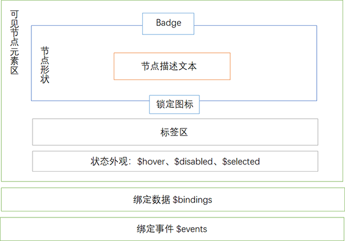

# 内置节点模板

## 组成



### 形状节点

:::demo
```html
<template>
  <Diagram height="200px" :nodes="nodes" :options="options"></Diagram>
</template>
<script>

  import {Diagram, circle, rectangle, diamond, templateMap, grid} from '$ui/gojs'

  export default {
    components: {
      Diagram
    },
    data() {
      return {
        nodes: [
          {
            key: 1,
            category: 'circle'
          },
          {
            key: 2,
            category: 'rectangle'
          },
          {
            key: 3,
            category: 'diamond'
          }
        ],
        options: {
          layout: grid(),
          nodeTemplateMap: templateMap({
            circle: circle({
              shape: {
                width: 100,
                height: 100
              },
              label: {
                text: '圆形节点'
              },
              tags: {
                itemArray: [
                  {label: '男'},
                  {label: '本科'},
                  {label: '程序员'}
                ]
              },
              badge: {
                label: {
                  text: 11
                }
              }
            }),
            rectangle: rectangle({
              shape: {
                width: 200,
                height: 100
              },
              label: {
                text: '矩形节点'
              },
              tags: {
                itemArray: [
                  {label: '男'},
                  {label: '本科'},
                  {label: '程序员'}
                ]
              },
              badge: {
                label: {
                  text: 12
                }
              }
            }),
            diamond: diamond({
              shape: {
                width: 200,
                height: 100
              },
              label: {
                text: '菱形节点'
              },
              tags: {
                itemArray: [
                  {label: '男'},
                  {label: '本科'},
                  {label: '程序员'}
                ]
              },
              badge: {
                label: {
                  text: 13
                }
              }
            })
          })
        }
      }
    }
  }
</script>

```
:::

### 图标节点

:::demo
```html
<template>
  <Diagram height="200px" :nodes="nodes" :options="options"></Diagram>
</template>
<script>

  import {Diagram, icon, grid} from '$ui/gojs'

  const home = 'F M32 18.451l-16-12.42-16 12.42v-5.064l16-12.42 16 12.42zM28 18v12h-8v-8h-8v8h-8v-12l12-9z'

  export default {
    components: {
      Diagram
    },
    data() {
      return {
        nodes: [
          {
            key: 1
          }
        ],
        options: {
          layout: grid(),
          nodeTemplate: icon({
            icon: {
              geometryString: home,
              width: 80,
              height: 80
            },
            shape: {
              figure: 'Circle'
            },
            label: {
              text: '带图标的节点'
            },
            tags: {
              itemArray: [
                {label: '男'},
                {label: '博士'},
                {label: '科研'}
              ]
            }
          })
        }
      }
    }
  }
</script>

```
:::

### 图片节点

:::demo
```html
<template>
  <Diagram height="200px" :nodes="nodes" :options="options"></Diagram>
</template>
<script>

  import {Diagram, image, grid} from '$ui/gojs'

  import imgSrc from '$ui/gojs/sources/朋友圈.png'

  export default {
    components: {
      Diagram
    },
    data() {
      return {
        nodes: [
          {
            key: 1
          }
        ],
        options: {
          layout: grid(),
          nodeTemplate: image({
            image: {
              source: imgSrc,
              width: 80,
              height: 80
            },
            label: {
              text: '图片节点'
            },
            tags: {
              itemArray: [
                {label: '男'},
                {label: '博士'},
                {label: '科研'}
              ]
            }
          })
        }
      }
    }
  }
</script>

```
:::

## 配色

:::demo
```html
<template>
  <Diagram height="200px" :nodes="nodes" :options="options"></Diagram>
</template>
<script>

  import {go, Diagram, circle, theme, grid, templateMap} from '$ui/gojs'

  export default {
    components: {
      Diagram
    },
    data() {
      return {
        nodes: [
          {key: 1},
          {key: 2, category: 'color1'},
          {key: 3, category: 'color2'},
          {key: 4, category: 'color3'},
          {key: 5, category: 'color4'},
          {key: 6, category: 'color5'},
          {key: 7, category: 'color6'}
        ],
        options: {
          layout: grid({
             cellSize: new go.Size(80, 80),
             spacing: new go.Size(20, 20)
          }),
          nodeTemplateMap: templateMap({
            '': this.createTemplate(),
            color1: this.createTemplate('color1'),
            color2: this.createTemplate('color2'),
            color3: this.createTemplate('color3'),
            color4: this.createTemplate('color4'),
            color5: this.createTemplate('color5'),
            color6: this.createTemplate('color6')
          })

        }
      }
    },
    methods: {
      createTemplate(name) {
        return circle({
          shape: {
            width: 80,
            height: 80
          },
          label: {
            text: name || 'default'
          }
        }, theme[name])
      }
    }
  }
</script>

```
:::


## Tooltip

:::demo
```html
<template>
  <Diagram height="200px" :nodes="nodes" :options="options"></Diagram>
</template>
<script>

  import {Diagram, circle} from '$ui/gojs'

  export default {
    components: {
      Diagram
    },
    data() {
      return {
        nodes: [
          {key: 1}
        ],
        options: {
          nodeTemplate: circle({
            label: {
              text: '鼠标进入'
            },
            tooltip: {
              text: '鼠标经过提示文本'
            }
          })
        }
      }
    }
  }
</script>

```
:::

## 数据绑定

:::demo
```html
<template>
  <Diagram height="200px" :nodes="nodes" :options="options"></Diagram>
</template>
<script>

  import {go, Diagram, circle, grid} from '$ui/gojs'

  export default {
    components: {
      Diagram
    },
    data() {
      return {
        nodes: [
          {
            key: 1,
            fill: go.Brush.randomColor(),
            text: '张三',
            disabled: false,
            locked: false,
            count: 0,
            tags: ['本科', '男', '有为青年']
          },
          {
            key: 2,
            fill: go.Brush.randomColor(),
            text: '李四',
            disabled: true,
            locked: false,
            count: 20,
            tags: ['硕士', '女', '有为青年']
          },
          {
            key: 3,
            fill: go.Brush.randomColor(),
            text: '王五',
            disabled: false,
            locked: true,
            count: 99,
            tags: ['博士', '男', '学识渊博']
          }
        ],
        options: {
          layout: grid(),
          nodeTemplate: circle({
            lock: true,
            label: {
              $bindings: [
                'text',
                new go.Binding('stroke', 'disabled', v => {
                  return v ? '#666' : '#fff'
                })
              ]
            },
            shape: {
              // 等价于：{text: 'text'}
              $bindings: ['fill']
            },
            badge: {
              label: {
                $bindings: [
                  new go.Binding('text', 'count'),
                  new go.Binding('visible', 'count', v => v > 0)
                ]
              }
            },
            tags: {
              $bindings: [
                new go.Binding('itemArray', 'tags', v => {
                  return v.map(n => {
                    return {label: n}
                  })
                })
              ]
            },
            $bindings: [
              new go.Binding('isEnabled', 'disabled', v => !v),
              new go.Binding('movable', 'locked', v => !v)
            ]
          })
        }
      }
    }
  }
</script>

```
:::


## 事件

:::demo
```html
<template>
  <Diagram height="200px" :nodes="nodes" :options="options"></Diagram>
</template>
<script>

  import {Diagram, circle, grid} from '$ui/gojs'

  export default {
    components: {
      Diagram
    },
    data() {
      return {
        nodes: [
          {
            key: 1,
            text: '张三'
          }
        ],
        options: {
          layout: grid(),
          nodeTemplate: circle({
            label: {
              $bindings: ['text']
            },
            $events: {
              click: this.handleClick,
              doubleClick: this.handleDblClick,
              mouseEnter: this.handleMouseEnter,
              mouseLeave: this.handleMouseLeave
            }
          })
        }
      }
    },
    methods: {
      handleClick(e, obj) {
        this.$message.info(`click: ${JSON.stringify(obj.data)}`)
        console.log('click', e, obj)
      },
      handleDblClick(e, obj) {
        this.$message.info(`dblclick: ${JSON.stringify(obj.data)}`)
        console.log('dblclick', e, obj)
      },
      handleMouseEnter(e, obj) {
        this.$message.info(`mouseEnter: ${JSON.stringify(obj.data)}`)
        console.log('mouseEnter', e, obj)
      },
      handleMouseLeave(e, obj) {
        this.$message.info(`mouseLeave: ${JSON.stringify(obj.data)}`)
        console.log('mouseLeave', e, obj)
      }
    }
  }
</script>

```
:::
